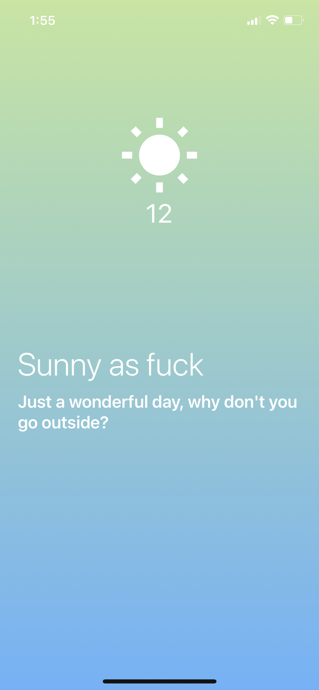

### Weather IOS/Android application with React Native

- [x] Loading 화면
- [x] Weather API 사용하여 현재 위치의 날씨 불러오기
- [x] 날씨에 따른 날씨 아이콘 추가
- [x] 날씨에 대한 글귀 추가

#### Example



#### How to Open

> https://expo.io/@b-chae/projects/howstheweather

##### Android

```
Scan QR Code to open this application
```

##### IOS

```
1) install 'Expo Go' at the AppStore
2) create an account and login
3) scan QR Code
```
